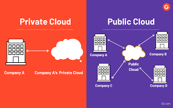
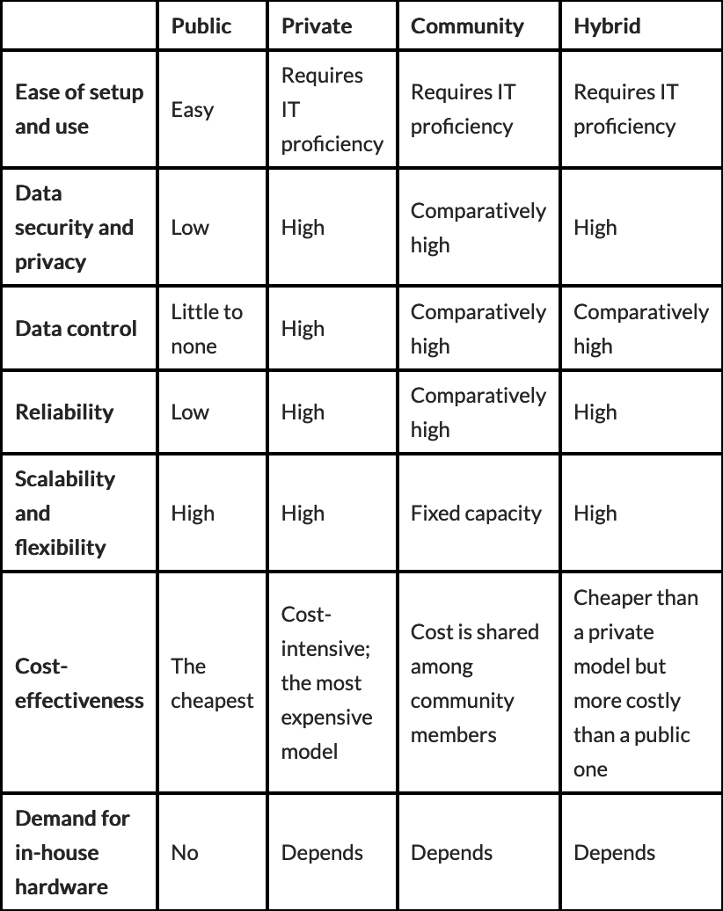
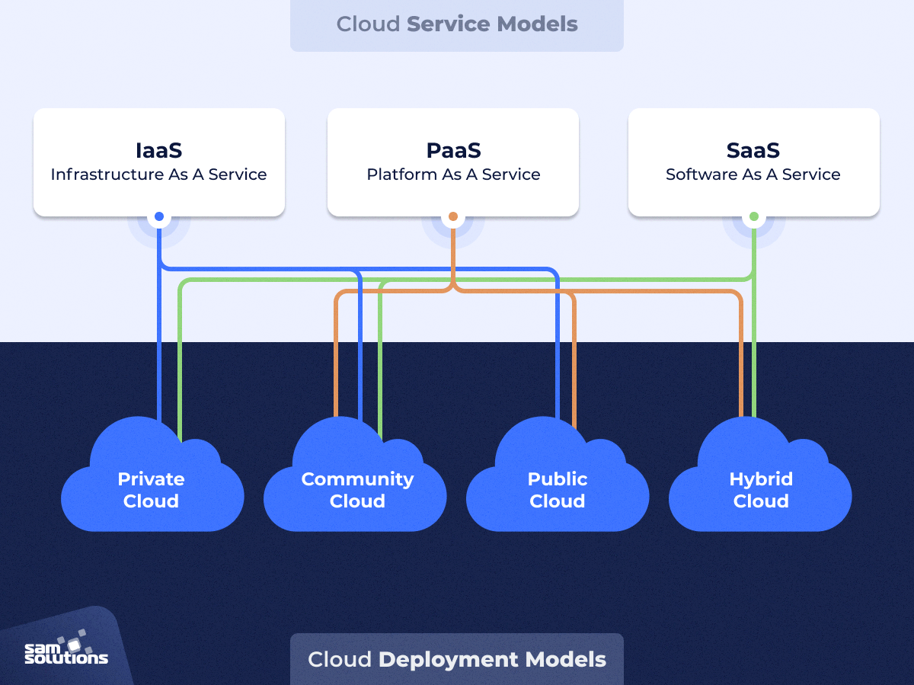

# Quick Introduction to Cloud

Before we talk about cloud security, we need to learn a basic knowledge of the cloud and learn the terminology. So first of all, I would like to mention about cloud deployment models and basic cloud service models. 

## Cloud Deployment Models

Before we dive into the essentials of the most popular cloud computing deployment models, let’s understand what a cloud deployment model is exactly. A cloud deployment model is a specific configuration of environment parameters such as the accessibility and proprietorship of the deployment infrastructure and storage size. According to deployment models, responsibilties can be change too. 

Lets get started!

There are four main types: public, private, hybrid and community clouds.:

### Public Cloud
This type of cloud deployment model supports all users who want to make use of a computing resource, such as hardware (OS, CPU, memory, storage) or software (application server, database) on a subscription basis. **Server infrastructure belongs to service providers** that manage it and administer pool resources, which is why there is no need for user companies to buy and maintain their own hardware. The public cloud deployment model is the first choice for businesses with low privacy concerns. 

### Private Cloud

There is little to no difference between a public and a private model from the technical point of view, as their architectures are very similar. However, as opposed to a public cloud that is available to the general public, only one specific company owns a private cloud. Private cloud is typically infrastructure used by a single organization. Multiple public cloud service providers, including Amazon, IBM, Cisco, Dell and Red Hat, also provide private solutions. Private clouds are more expensive than public clouds due to the capital expenditure involved in acquiring and maintaining them. However, private clouds are better able to address the security and privacy concerns of organizations today.

  

### Hybrid Cloud

Hybrid cloud allows companies to mix and match the facets of the three types that best suit their requirements. Many organizations make use of this model when they need to scale up their IT infrastructure rapidly, such as when leveraging public clouds to supplement the capacity available within a private cloud. With hybrid cloud organizations can improve their security and privacy besides reduce cost.

### Community Cloud

A community cloud is architecturally similar to a private cloud. However, only one organization can use the private cloud, while the community cloud can be used by more than one organization with the similar architecture. If all the participating organizations have uniform security, privacy and performance requirements, this multi-tenant data center architecture helps these companies enhance their efficiency, as in the case of joint projects and they can share the cost.

## Cloud Service Models

## References

- https://www.g2.com/articles/public-cloud
- https://www.sam-solutions.com
